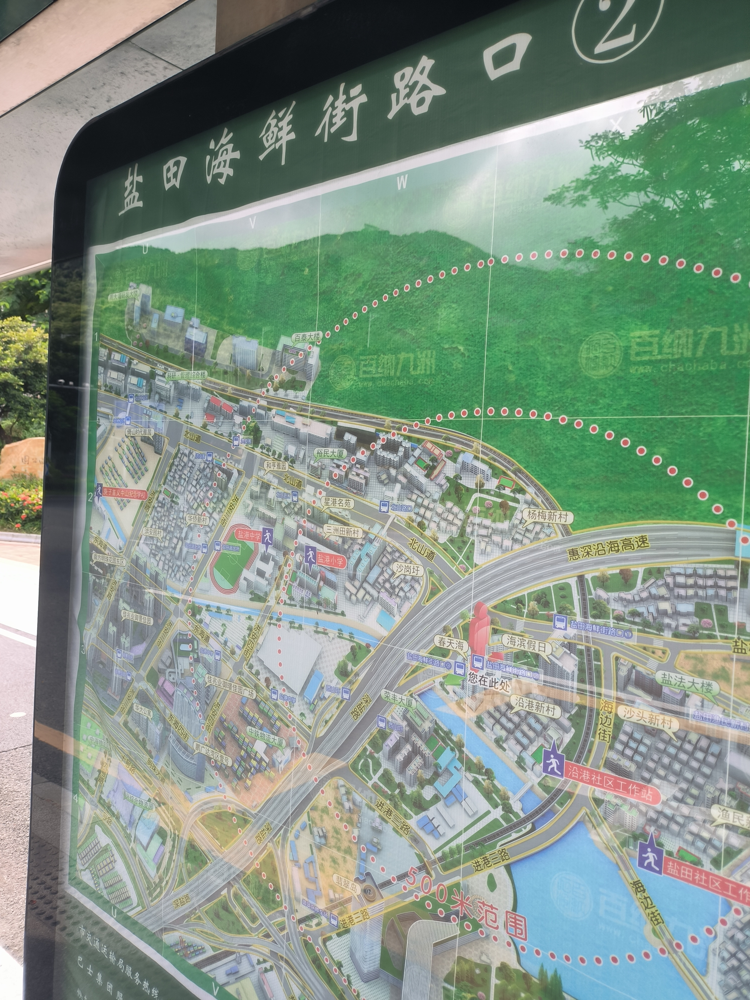
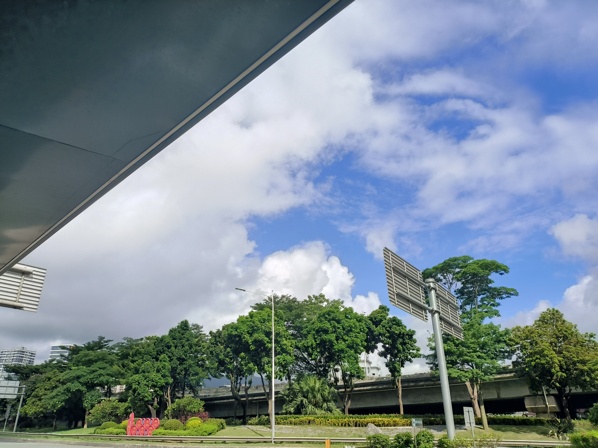
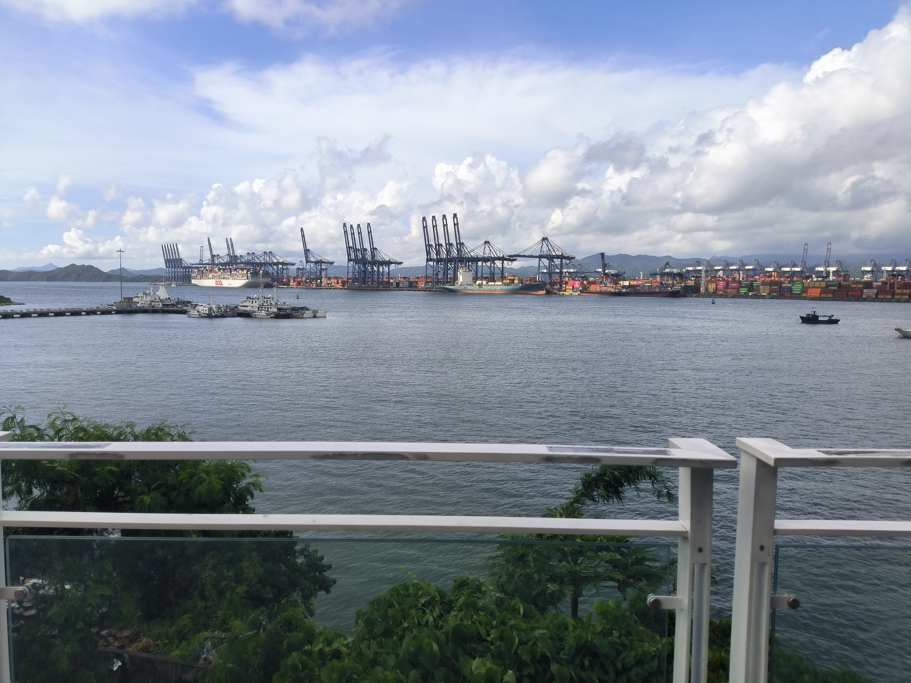

# 序言

无法看到尽头的大海与天空总是让人感到向往。

近来时间较为空闲，因此于昨日（2024 年 7 月 22 日）进行了一次较为全面的深圳市大小梅沙栈道步行，在此进行记录，以供来日回忆，以及供他人参考。

# 记录

## 出发

约早上 8:30 分，从【怡景地铁站】公交站出发，乘坐 M348 路公交车，前往【盐田海鲜街路口】站进行中转。

在怡景上车时，天气阴沉，下起了短时大雨。在车上，目睹了随车飞驰，大雨倾盆而下的场景，从而担心天气是否适合步行计划（好在后续证明这一担心是多余的）。

乘坐 M348 路公交车，而不是地铁前往大梅沙，主要是为了欣赏盐田港沿途的漂亮风景。这次也没失望，早晨阳光下的盐田港非常震撼：人造的大型设备与碧海蓝天的融合十分引人入胜。可惜的是，在车上未拍摄记录。

随后，于九时出头到达【盐田海鲜街路口】站，头顶蓝天和乌云交错，形成了一幅十分特别的光景。

在车站继续转 M196 路公交车，在【海滨绿道】站下车，这里可以从远处拍摄到盐田港的风景，结合远处的蓝天，十分漂亮。

